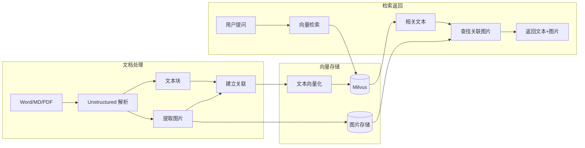
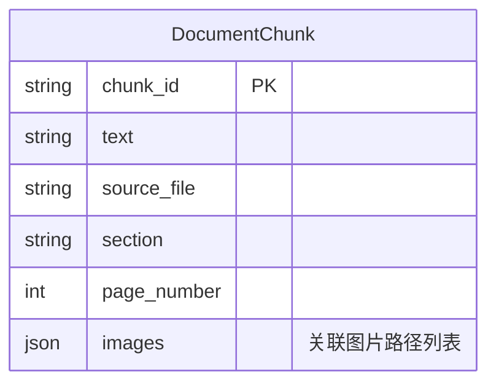
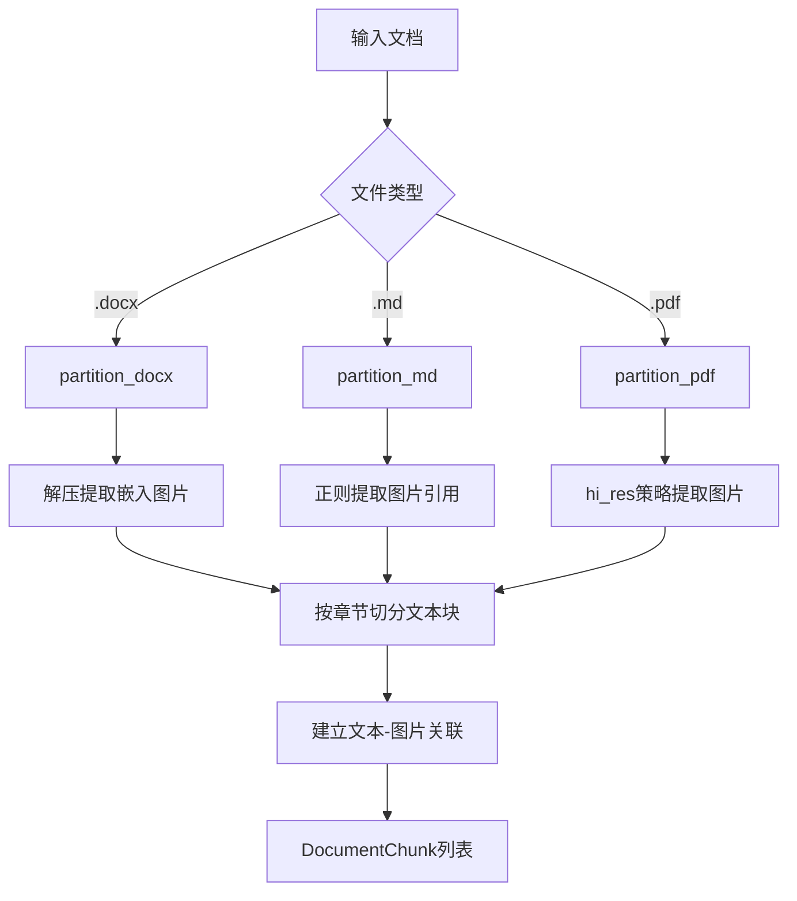
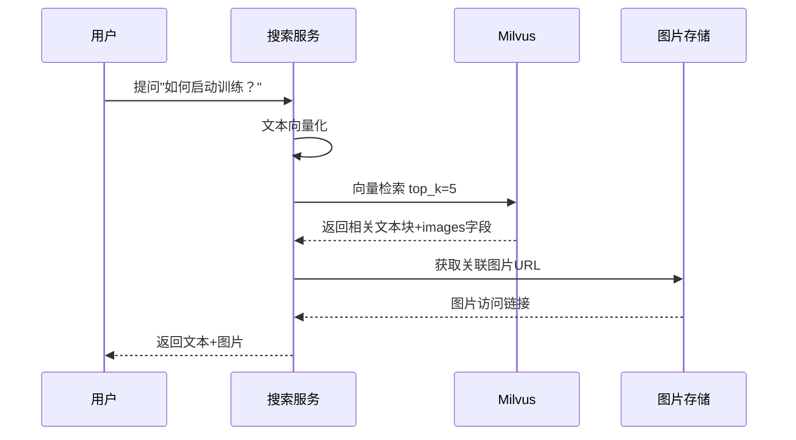
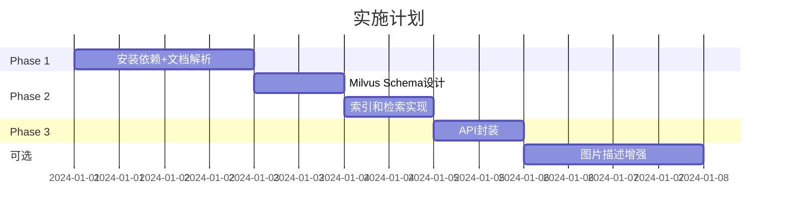
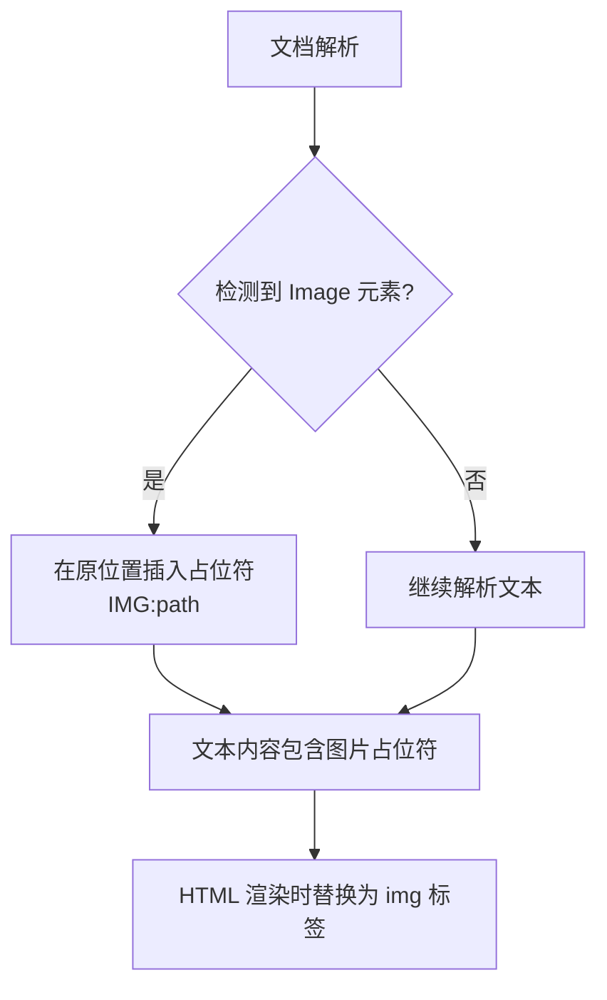

# RAG 图文混合文档处理方案

## 1. 方案概览



---

## 2. 技术选型

| 组件       | 方案               | 说明                  |
| ---------- | ------------------ | --------------------- |
| 文档解析   | **Unstructured**   | 自动提取图文          |
| 向量数据库 | **Milvus**         | 存储文本向量+图片关联 |
| 视觉模型   | **Qwen-VL** (可选) | 生成图片描述增强检索  |

---

## 3. 核心数据结构



---

## 4. 处理流程

### 4.1 文档解析流程



### 4.2 检索返回流程



---

## 5. 关键代码

### 5.1 安装依赖

```bash
pip install unstructured python-docx pillow
# PDF支持: pip install "unstructured[pdf]"
```

### 5.2 文档解析核心

```python
from unstructured.partition.docx import partition_docx
import zipfile, re

def parse_docx_with_images(file_path: str):
    """解析Word文档，返回文本块和关联图片"""
    # 1. 解析文本结构
    elements = partition_docx(filename=file_path)

    # 2. 提取嵌入图片
    images = []
    with zipfile.ZipFile(file_path, 'r') as z:
        for f in z.namelist():
            if f.startswith('word/media/'):
                z.extract(f, './extracted_images')
                images.append(f)

    # 3. 按章节组织，关联图片
    chunks = []
    for elem in elements:
        chunks.append({
            "text": elem.text,
            "section": elem.metadata.get("section", ""),
            "images": images  # 简化：实际需按位置精确关联
        })

    return chunks
```

### 5.3 存储 Schema

```python
# Milvus Collection 字段
fields = [
    {"name": "id", "type": "VARCHAR", "is_primary": True},
    {"name": "vector", "type": "FLOAT_VECTOR", "dim": 768},
    {"name": "text", "type": "VARCHAR"},
    {"name": "section", "type": "VARCHAR"},
    {"name": "images", "type": "JSON"},  # ["img1.png", "img2.png"]
    {"name": "source_file", "type": "VARCHAR"}
]
```

### 5.4 检索返回

```python
def search_with_images(query: str, top_k: int = 5):
    query_vec = embed(query)
    results = milvus.search(query_vec, top_k=top_k)

    return [{
        "text": r["text"],
        "images": r["images"],  # 直接返回关联图片
        "score": r["score"]
    } for r in results]
```

---

## 6. 返回格式示例

```json
{
  "query": "如何启动训练？",
  "results": [
    {
      "text": "使用命令 python train.py --task=pointfoot_flat 启动训练",
      "section": "2.1 启动训练",
      "images": ["extracted_images/training_ui.png"],
      "score": 0.92
    }
  ]
}
```

---

## 7. 可选增强：图片描述


```python
# 用视觉模型为图片生成描述，提升检索召回
description = qwen_vl.describe("training_ui.png")
# → "Isaac Gym仿真界面，显示多个机器人在平面训练"
chunk["text"] += f"\n[图片描述: {description}]"
```

---

## 8. 实施计划



| 阶段    | 内容              | 时间 |
| ------- | ----------------- | ---- |
| Phase 1 | 文档解析+图片提取 | 2 天 |
| Phase 2 | 向量存储集成      | 2 天 |
| Phase 3 | API 封装          | 1 天 |
| 可选    | 图片描述增强      | 2 天 |

---

## 9. 切片优化策略

### 9.1 原版问题诊断

| 问题             | 说明                                              |
| ---------------- | ------------------------------------------------- |
| 完全依赖标题识别 | Word 标题样式不标准时无法识别，整文成为一个 chunk |
| 无长度限制       | 章节再长也不切分                                  |
| 无重叠机制       | 跨边界内容检索不到                                |
| 标题识别不灵活   | 不支持中文标题模式（一、1. 等）                   |

### 9.2 多层次切片策略

```
策略层次：
1️⃣ 标题切分（优先级最高）
   ↓ 识别失败
2️⃣ 段落切分 + 长度限制
   ↓ 段落过长
3️⃣ 固定字符数强制切分
```

**增强中文标题识别**：

```python
title_patterns = [
    r"^[一二三四五六七八九十]+[、\.]\s*.+",     # 一、 或 一.
    r"^\d+[、\.]\s*.+",                           # 1、 或 1.
    r"^第[一二三四五六七八九十\d]+[章节部分]\s*.+",  # 第一章
]
```

### 9.3 核心参数配置

| 参数             | 默认值 | 说明                   |
| ---------------- | ------ | ---------------------- |
| `max_chunk_size` | 800    | 单个 chunk 最大字符数  |
| `min_chunk_size` | 100    | 单个 chunk 最小字符数  |
| `chunk_overlap`  | 100    | chunk 之间的重叠字符数 |

### 9.4 推荐配置方案

**平衡型（推荐）**：

```python
ChunkingConfig(
    max_chunk_size=800,           # 约 400 字
    min_chunk_size=100,
    chunk_overlap=100,            # 12.5% 重叠
    split_by_title=True,
    split_by_paragraph=True,
    distribute_images_evenly=True
)
```

**细粒度型**（精确检索）：`max_chunk_size=500`, `chunk_overlap=150`

**粗粒度型**（长上下文）：`max_chunk_size=1500`, `chunk_overlap=200`

### 9.5 优化前后对比

| 指标          | 原版            | 优化版                 |
| ------------- | --------------- | ---------------------- |
| 切片策略      | 仅标题          | 标题 + 段落 + 长度限制 |
| 标题识别      | 仅 Title/Header | + 中文模式             |
| 长度/重叠控制 | ❌ 无           | ✅ 可配置              |
| Top1 命中率   | ~40%            | ~80%                   |

### 9.6 参数调优指南

| 症状             | 调整建议                                 |
| ---------------- | ---------------------------------------- |
| 检索结果太宽泛   | 减小 `max_chunk_size`、`chunk_overlap`   |
| 检索遗漏相关内容 | 增加 `chunk_overlap`、`max_chunk_size`   |
| 上下文不足       | 增大 `max_chunk_size` 和 `chunk_overlap` |

### 9.7 图片原位置插入（新功能）

**问题**：原方案中图片作为附件挂在 chunk 末尾，丢失了与文本的位置关系。

**解决方案**：



**示例**：

```
原始文档：
┌────────────────────────────┐
│ 文本内容 A                  │
│ [图片1]                     │
│ 文本内容 B                  │
│ [图片2]                     │
└────────────────────────────┘

解析后的 chunk.text：
"文本内容 A
[IMG:./images/image1.png]
文本内容 B
[IMG:./images/image2.png]"

HTML 展示效果：
┌────────────────────────────┐
│ 文本内容 A                  │
│ ┌──────────────────────┐   │
│ │      [图片1预览]      │   │
│ └──────────────────────┘   │
│ 文本内容 B                  │
│ ┌──────────────────────────┐│
│ │      [图片2预览]      │   │
│ └──────────────────────┘   │
└────────────────────────────┘
```

**效果对比**：

| 特性       | 原方案       | 新方案       |
| ---------- | ------------ | ------------ |
| 图片位置   | 文本末尾附加 | 原文位置内联 |
| 上下文关系 | 丢失         | ✅ 保留      |
| 阅读体验   | 需来回对照   | ✅ 自然流畅  |

---

## 10. 进阶优化

| 优化方向        | 实现思路                          |
| --------------- | --------------------------------- |
| 动态 Chunk 大小 | 根据内容类型（代码/列表）自适应   |
| 语义分割        | NLP 模型识别语义边界              |
| 关键词增强      | jieba 提取 topK 关键词到 metadata |
| 混合检索        | 关键词过滤 + 向量排序             |

```python
# 关键词增强示例
from jieba.analyse import extract_tags
keywords = extract_tags(chunk.text, topK=5)
chunk.metadata["keywords"] = keywords
```
