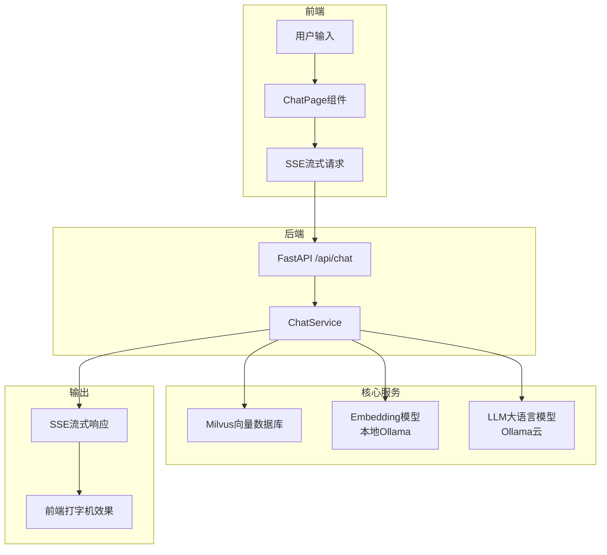
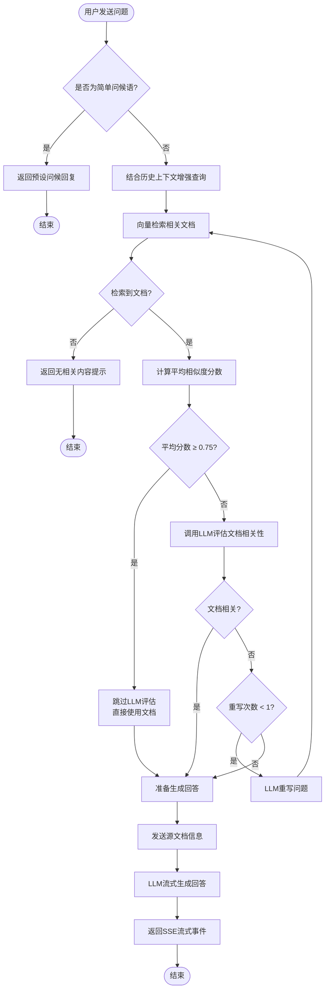
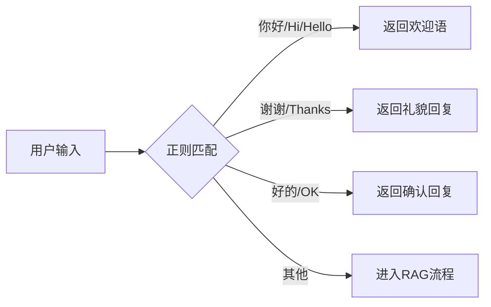
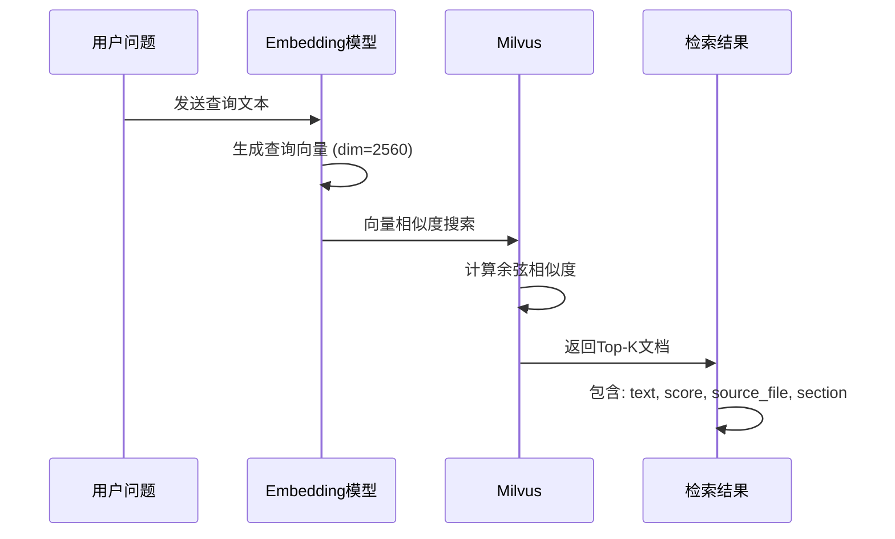
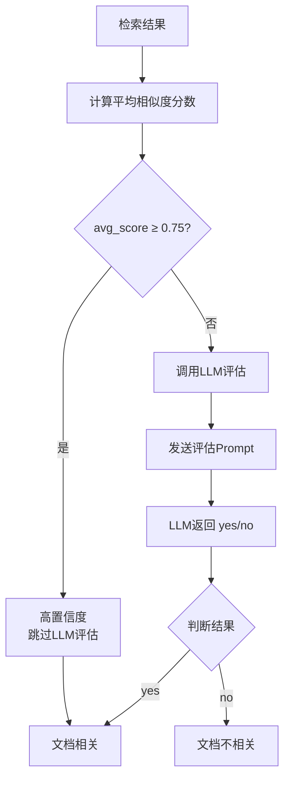
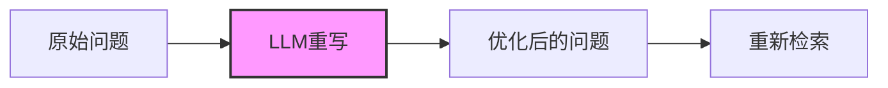
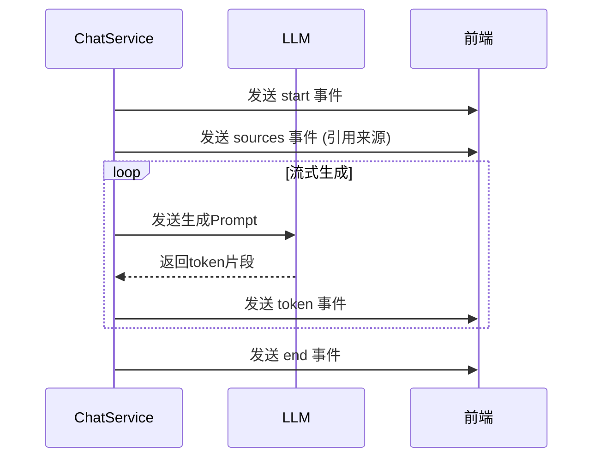
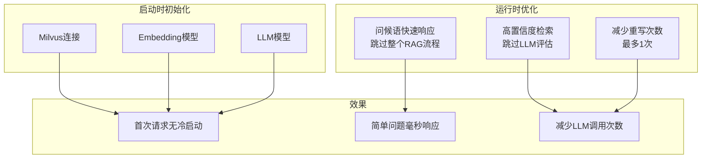
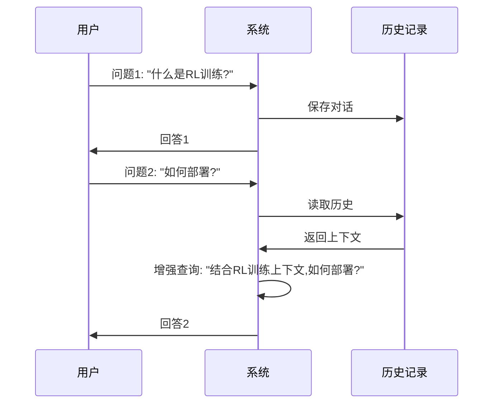
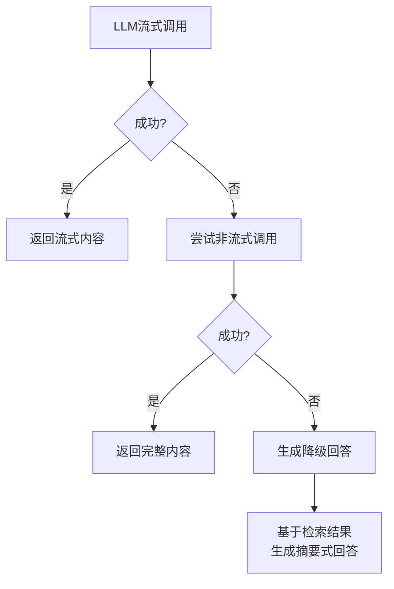

# RAG 智能问答系统流程说明

## 概述

本系统采用 **RAG (Retrieval-Augmented Generation)** 架构，结合向量检索与大语言模型，实现基于文档知识库的智能问答功能。

## 系统架构



## 完整问答流程



## 核心模块详解

### 1. 问候语快速响应

系统内置常见问候语识别，避免不必要的 RAG 流程：



**支持的问候语模式**：

- 中文：你好、早上好、下午好、晚上好、谢谢、好的、知道了
- 英文：Hi、Hello、Thanks、OK

### 2. 向量检索流程



### 3. 文档相关性评估



**评估 Prompt 模板**：

```
你是一名评审员，需要判断检索到的文档与用户问题的相关性。

检索到的文档：
{context}

用户问题：{question}

请判断文档是否与问题相关。只需回答 'yes' 或 'no'。
```

### 4. 问题重写机制

当文档相关性评估为"不相关"时，系统会尝试重写问题：



**重写 Prompt 模板**：

```
请审视输入内容，并尽量推理其潜在的语义意图。
这是最初的问题：
{question}
请将其改写为更优的问题，只输出改写后的问题。
```

### 5. 回答生成流程



**生成 Prompt 模板**：

```
你是一名专业的问答助手。请利用以下检索到的上下文片段来回答问题。
如果上下文中没有相关信息，就直接说你不知道，不要编造答案。
回答要详细、准确，并尽可能引用原文内容。

上下文：
{context}

问题：{question}

回答：
```

## SSE 事件类型

| 事件类型  | 说明     | 数据内容 |
| --------- | -------- | -------- |
| `start`   | 开始处理 | 无       |
| `token`   | 回答片段 | 文本内容 |
| `sources` | 引用来源 | 文档列表 |
| `end`     | 处理完成 | 无       |
| `error`   | 发生错误 | 错误信息 |

## 性能优化策略



### 优化前后对比

| 场景         | 优化前         | 优化后             |
| ------------ | -------------- | ------------------ |
| 首次请求     | 需要初始化连接 | 服务启动时已初始化 |
| "你好"       | 6 次 LLM 调用  | 0 次 LLM 调用      |
| 高相似度问题 | 必须 LLM 评估  | 跳过评估           |
| 低相关度问题 | 最多 2 次重写  | 最多 1 次重写      |

## 多轮对话支持



**历史上下文模板**：

```
以下是之前的对话历史，请结合历史上下文理解当前问题：

用户：什么是RL训练?
助手：RL训练是...

当前问题：如何部署?
```

## 错误处理与降级



## 技术栈

| 组件       | 技术选型       | 说明                   |
| ---------- | -------------- | ---------------------- |
| 后端框架   | FastAPI        | 异步支持，SSE 流式响应 |
| 向量数据库 | Milvus         | 高性能向量检索         |
| Embedding  | Ollama (本地)  | 文本向量化，dim=2560   |
| LLM        | Ollama (云)    | gpt-oss:120b           |
| 前端框架   | React + HeroUI | 现代化 UI 组件         |
| 状态管理   | React Hooks    | 简洁高效               |

## 文件结构

```
backend/
├── app/
│   ├── api/endpoints/
│   │   └── chat.py          # Chat API 端点
│   ├── services/
│   │   ├── chat_service.py  # RAG 核心逻辑
│   │   └── milvus/
│   │       └── client.py    # Milvus + LLM 客户端
│   └── main.py              # 应用入口 + 生命周期管理

frontend/
├── app/
│   ├── components/
│   │   └── ChatPage.tsx     # 聊天界面组件
│   └── lib/
│       └── api.ts           # API 客户端 + SSE 处理
```
