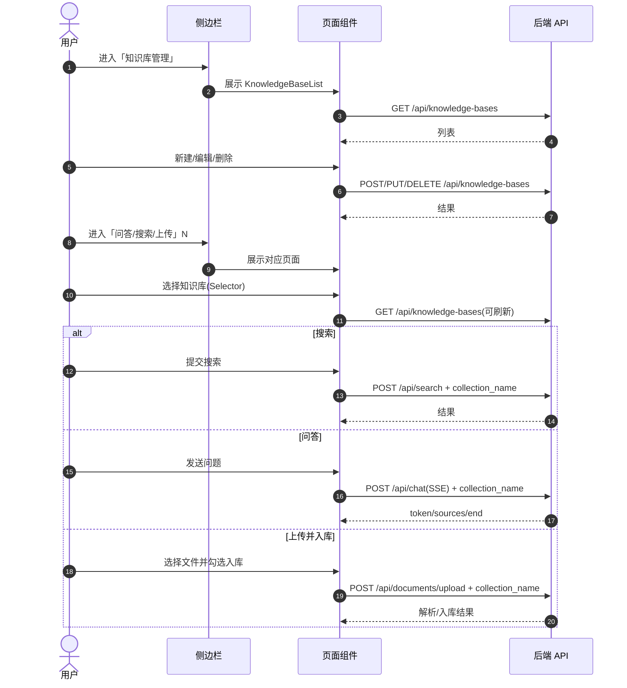

## 前端技术选型

- **框架**: React
- **路由/页面组织**: React Router（单页内通过侧边栏菜单切换视图）
- **UI 组件库**: HeroUI
- **请求层**: `fetch` + 轻量封装（`app/lib/api.ts`）

## 功能方案（页面与组件）

- **知识库管理页**：列表浏览 + 新建/编辑/删除
  - 组件：`app/components/KnowledgeBaseList.tsx`
- **知识库选择器**：在问答/搜索/上传场景统一选择当前知识库
  - 组件：`app/components/KnowledgeBaseSelector.tsx`
- **菜单入口**：侧边栏新增“知识库管理”
  - 组件：`app/components/Sidebar.tsx`

## 数据流向（前端视角）

```mermaid
flowchart TD
  Home[home.tsx\nknowledgeBase state] --> Chat[ChatPage]
  Home --> Search[SearchForm]
  Home --> Upload[FileUpload]
  KBSelector[KnowledgeBaseSelector] -->|GET /api/knowledge-bases| KBAPI[后端 knowledge-bases]
  KBList[KnowledgeBaseList] -->|CRUD /api/knowledge-bases| KBAPI

  Search -->|POST /api/search\ncollection_name| SearchAPI[后端 search]
  Chat -->|POST /api/chat (SSE)\ncollection_name| ChatAPI[后端 chat]
  Upload -->|POST /api/documents/upload\n(勾选入库才带 collection_name)| UploadAPI[后端 upload]
```

## 操作交互（用户流程）



## 关键文件

- 页面编排/共享 state：`frontend/app/routes/home.tsx`
- 菜单：`frontend/app/components/Sidebar.tsx`
- 选择器：`frontend/app/components/KnowledgeBaseSelector.tsx`
- 管理页：`frontend/app/components/KnowledgeBaseList.tsx`
- 接入点：`frontend/app/components/ChatPage.tsx`、`SearchForm.tsx`、`FileUpload.tsx`
- API 封装：`frontend/app/lib/api.ts`
