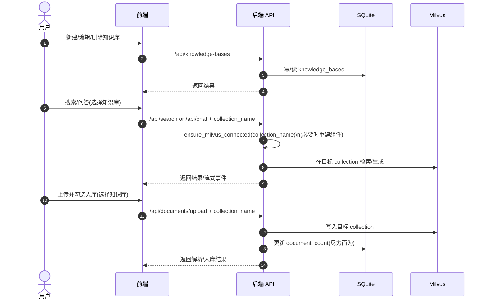

## 后端技术选型

- **Web 框架**: FastAPI
- **元数据存储**: SQLite（`sqlalchemy` + `aiosqlite`，异步 Session）
- **向量存储**: Milvus（按 `collection_name` 做知识库隔离）

## 功能方案（知识库 CRUD）

- **知识库 = 元数据记录 + 对应的 Milvus collection**
- 元数据字段：`id`、`name`、`description`、`collection_name`、`document_count`、`created_at`、`updated_at`
- 启动时自动创建 **默认知识库**（映射到 `settings.MILVUS_COLLECTION_NAME`）

## API 设计

- `GET /api/knowledge-bases`：列表
- `POST /api/knowledge-bases`：创建（`name/description/collection_name`）
- `GET /api/knowledge-bases/{id}`：详情
- `PUT /api/knowledge-bases/{id}`：更新（仅 `name/description`）
- `DELETE /api/knowledge-bases/{id}`：删除（先尝试 drop 对应 Milvus collection，再删除元数据）

## 数据流向（关键链路）

```mermaid
flowchart TD
  FE[前端] -->|GET/POST/PUT/DELETE /api/knowledge-bases| KBAPI[知识库 API]
  KBAPI -->|读写| SQLite[(SQLite: knowledge_bases)]

  FE -->|POST /api/search (collection_name)| SearchAPI[搜索 API]
  FE -->|POST /api/chat (collection_name)| ChatAPI[问答 API]
  SearchAPI --> Ensure[ensure_milvus_connected(collection_name)]
  ChatAPI --> Ensure
  Ensure -->|若需切换| Reinit[重建 Milvus/RAG 组件]
  Ensure -->|使用目标 collection| Milvus[(Milvus)]

  FE -->|POST /api/documents/upload (collection_name)| UploadAPI[上传解析 API]
  UploadAPI --> Ensure
  UploadAPI -->|索引 chunks| Milvus
  UploadAPI -->|读 num_entities 并回写| SQLite
```

## 操作交互（后端视角）



## 关键文件

- 配置：`backend/app/config.py`（`DATABASE_URL`）
- DB 初始化：`backend/app/database.py`、`backend/app/main.py`（lifespan 调 `init_db`）
- ORM 模型：`backend/app/models/knowledge_base.py`
- API：`backend/app/api/endpoints/knowledge_base.py`
- collection 切换：`backend/app/dependencies.py`（`ensure_milvus_connected`）
- 上传入库带 collection：`backend/app/api/endpoints/documents.py`
